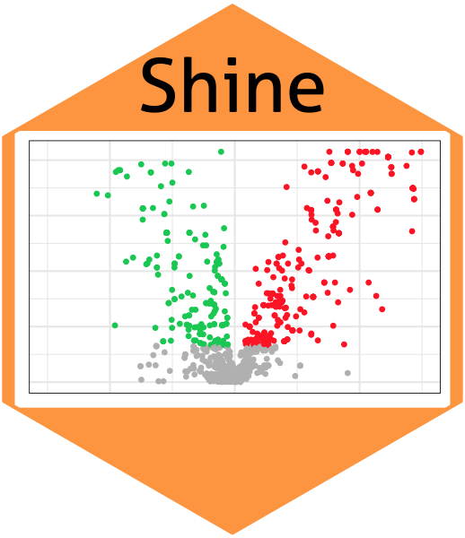

# Shine 

## About

`Shine` is a R packge which is used for analyzing untargeted metabolomics data based UPLC-HRMS 

## Installation

You can install `Shine` from [Github](https://github.com/shineshen007/Shine).

```r
# Install `Shine` from GitHub
if(!require(devtools)){
install.packages("devtools")
}
devtools::install_github("shineshen007/Shine")
```
## Example

This is a basic example which shows you how to solve a common problem:

``` r
library(Shine)
## basic example code
StaAnalysis(p.cutoff = 0,
                        group = c("case","control"),
                        splot = FALSE,
                        colv = c("SpringGreen3","grey","Firebrick1"),
                        unitest ="wilcox.test",
                        pcorrect = TRUE,
                        xlim = c(-3,3),
                        paired = FALSE,
                        h=0.2,
                        PCA = FALSE,
                        heatmap = FALSE)
```

