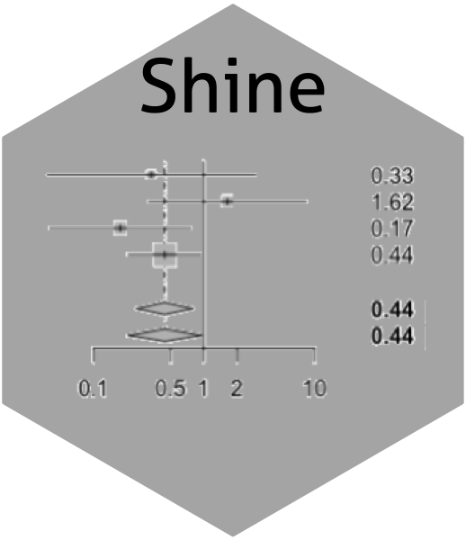

# Shine 

## About

`Shine` is a R package which is used for analyzing untargeted metabolomics data generated form UPLC-HRMS 

## Installation

You can install `Shine` from [Github](https://github.com/shineshen007/Shine).

```r
# Install `Shine` from GitHub
if(!require(devtools)){
install.packages("devtools")
}
devtools::install_github("shineshen007/Shine")
```
## Example

``` r
library(Shine)
## basic example code
StaAnalysis(group = c("case","control"),
            unitest ="wilcox.test")
                        
```

